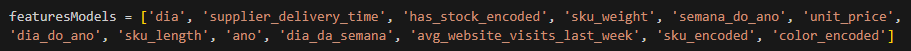

# Documentação Modelo Preditivo - Inteli

## Apolo
### Apolo
#### (Beatriz Monsanto, Ivan Ferreira, Michel Khafif, Paula Piva, Pedro Morita, Tommy Goto)

## Sumário
[1. Introdução](#c1)

[2. Objetivos e Justificativa](#c2)

[3. Metodologia](#c3)

[4. Desenvolvimento e Resultados](#c4)

[5. Conclusões e Recomendações](#c5)

[6. Referências](#c6)

[Anexos](#attachments)

## 1. Introdução

&emsp;Nascida em 2011, a Mobly é uma loja de varejo com o foco direcionado a venda de móveis e objetos de decoração, contando com um catálogo de aproximadamente 275 mil itens e com presença em todo o país. Teve seu início após receber investimentos de diversos grupos, tais como o grupo alemão Rocket Internet e foi criada com base em um modelo focado em negócios digitais, idealizada por empreendedores que se interessaram pela metodologia após estudos no exterior. [1]

&emsp;Atualmente, atua em um mercado com valor estimado de 130 bilhões de reais, onde tem seu enfoque no mercado de 7.2 bilhões de reais que é o de E-Commerce, com cerca de 825 mil usuários ativos, cerca de 0.9 bilhões de reais em GVM e mais de 20 espaços físicos, criados para proporcionar a experiência da loja online de forma mais real e próxima.

&emsp;No momento atual, o sistema de recompra da Mobly apenas se utiliza de dados baseados em histórico ponderado de acordo com recência, inputs manuais como os de classificação de produto e o sistema de forecast de vendas atual da empresa. Mesmo funcionando, o modelo atual gera problemas de estoque, onde produtos de baixo giro se acumulam facilmente e em vários casos ocorre ruptura, faltando produtos para venda e/ou entrega.

## 2. Objetivos e Justificativa
### 2.1 Objetivos

&emsp;O objetivo do projeto é desenvolver uma solução que utilize um modelo preditivo para prever as vendas de diferentes SKUs dos produtos da Mobly. Esse modelo deve considerar diversas variáveis, incluindo consumo, intenção de compra, momento de compra e cenário macroeconômico. Com isso, é esperado uma melhora na previsão de vendas da Mobly e assim, resultando em uma elevação na qualidade de gestão de estoque e na recompra de produtos.

### 2.2 Proposta de solução

&emsp;Nosso modelo preditivo visa analisar os dados de vendas fornecidos pela Mobly, fazendo a limpeza e relacionamento entre os dados, de forma a prever em um alcance de 90 dias, com precisão de 70% por dia e 90% por semana, a quantidade de vendas de cada SKU da empresa. 

&emsp;Nosso modelo será utilizado pela área de Supply Chain, mais especificamente pelos analistas de dados, que irão inserir os dados que desejam analisar, tratar esses dados removendo os irrelevantes ou prejudiciais ao modelo, realizar as relações entre eles e analisar a predição final Assim, ele poderá fazer um relatório para que o gerente de estoques possa administrar melhor o funcionamento do estoque da empresa e agendar recompras se necessário.

### 2.3 Justificativa
&emsp;Como uma loja de varejo, é fundamental para a Mobly manter seus estoques em primeiro plano. Ao efetuar compras, os clientes esperam que seus pedidos estejam disponíveis para entrega, reduzindo prazos e ampliando a satisfação com a empresa. Contudo, o sistema de recompra da Mobly, que se baseia no histórico de vendas ponderado, enfrenta dificuldades em manter um número assertivo de vendas futuras, principalmente devido as flutuações sazonais.

&emsp;Empregando um modelo preditivo, é possível analisar além dos históricos, considerando fatores internos e externos, para encontrar padrões e tendências que auxiliam a estimar as vendas futuras, tais como inflação, taxa de empregabilidade, juros e dólar. Com a implementação dessa estratégia, a Mobly conseguirá aprimorar a precisão nas previsões de demandas, garantindo de maneira eficaz a disponibilidade de estoque para atender os pedidos dos clientes, mesmo diante das variações sazonais. 

## 3. Metodologia

CRISP-DM - Etapas da Processo:

1. Entendimento do Negócio: 
    - Esta fase se concentra em entender o projeto em seus objetivos e requisitos, desde uma perspectiva de negócios, e então converter este conhecimento em uma definição de problema de mineração de dados e em um plano preliminar.
    
2. Compreensão dos Dados: 
    - A etapa envolve coletar os dados e familiarizar-se com eles, identificar problemas de qualidade dos dados, descobrir primeiras informações ou detectar subconjuntos interessantes para formar hipóteses sobre informações escondidas.
    
3. Preparação dos Dados:
    - Nesta fase, os dados são limpos, transformados e enriquecidos, se necessário, para modelagem. Também podem ser construídos novos conjuntos de dados, se a ferramenta de modelagem precisar de um formato específico.
    
4. Modelagem dos Dados:
    - Esta etapa envolve a seleção de técnicas de modelagem, a escolha de quais dados serão usados para a modelagem (por exemplo, um subconjunto), a definição de testes a serem usados para avaliar o modelo, e a construção e avaliação do modelo.
    
5. Avaliação:
    - Uma vez que o modelo foi construído, ele precisa ser avaliado em relação aos objetivos de negócios definidos na primeira fase. Nesta etapa, é fundamental determinar se os resultados da modelagem realmente alcançam os objetivos de negócios e são suficientemente robustos para serem implementados.

6. Implantação:
    - A etapa de implantação envolve colocar o modelo em um ambiente operacional, planejar o monitoramento e a manutenção contínuos deste, e produzir um plano final de implantação, uma estratégia de monitoramento e um plano de manutenção.

&emsp;Referencial Teórico: O processo CRISP-DM foi introduzido na década de 1990 e tem sido amplamente adotado pela comunidade de mineração de dados, tanto na academia quanto na indústria. Seu foco é oferecer uma estrutura para planejar, organizar e realizar projetos de mineração de dados. Desde sua introdução, vários estudos e publicações destacaram a relevância e a aplicabilidade da CRISP-DM em diferentes cenários.

&emsp;Com base no desenvolvimento do projeto, nós já passamos pelas primeiras três etapas e estamos atualmente na etapa de Modelagem dos Dados. Após isso, ainda terá as etapas de Avaliação e Implantação para concluir.

## 4. Desenvolvimento e Resultados
### 4.1. Compreensão do Problema
#### 4.1.1. Contexto da indústria 

&emsp;No contexto geral do setor de móveis e decoração, a Mobly se destaca como uma força inovadora. A revolução do comércio eletrônico tem mudado a forma como os consumidores compram produtos, e a Mobly soube aproveitar essa mudança. Diante de forte concorrência, a empresa se posiciona frente a concorrentes notáveis, como a Magalu, que oferece uma grande variedade de produtos, a Tok&Stok, conhecida por seu design funcional, a Leroy Merlin, com foco em móveis externos, a Camicado, especializada em decoração, e a MadeiraMadeira, que é similar à Mobly como plataforma de e-commerce para móveis e decoração. [2]

&emsp;O modelo de negócios da Mobly se baseia em uma plataforma de comércio eletrônico completa, abordando vários aspectos essenciais para o sucesso no mercado. Além da variedade de produtos, a empresa colabora com diversos fornecedores, assegurando uma ampla gama de materiais. Além disso, a Mobly investe em logística eficiente para entregar produtos rapidamente aos clientes. Preços competitivos, promoções atrativas e foco no atendimento ao cliente fortalecem a posição da Mobly como escolha preferida para consumidores em busca de qualidade para suas casas. É relevante notar que a Mobly vai além do ambiente online, também tendo lojas físicas para interagir com os clientes. [2]

&emsp;O mercado de móveis e decoração está sujeito a tendências em constante mudança, moldando a competição e estratégias das empresas. A Mobly, central nesse contexto, é impulsionada pelo crescimento do comércio eletrônico. A crescente demanda por experiências personalizadas e centradas no cliente motiva a Mobly a inovar e oferecer soluções únicas. A conscientização crescente sobre sustentabilidade e responsabilidade social também afeta as decisões dos consumidores, levando a abordagens mais ecologicamente conscientes.

&emsp;Ademais, a integração omnicanal é prioridade, já que os consumidores esperam uma experiência consistente entre plataformas online e lojas físicas. O uso de tecnologias inovadoras, como realidade aumentada para visualização de produtos, está mudando rapidamente a interação dos consumidores com os produtos antes de finalizarem suas escolhas. [2]

&emsp;Em síntese, a Mobly não é apenas uma empresa média no setor de móveis e decoração, mas sim um líder em inovação e transformação no mercado. Seu compromisso com aprimorar a experiência do cliente, junto com sua posição estratégica nas tendências emergentes, define sua trajetória de sucesso no competitivo mercado de comércio eletrônico de móveis e itens de decoração.

##### 4.1.1.1. 5 Forças de Porter

&emsp;No âmbito da Mobly e das considerações expostas anteriormente, a aplicação da análise das Cinco Forças de Porter se apresenta como uma abordagem estratégica de suma importância para a compreensão da posição competitiva que a empresa ocupa no mercado de comércio eletrônico, com foco em móveis e artigos de decoração. As Cinco Forças de Porter constituem uma metodologia que se debruça sobre os elementos que influenciam a atratividade de um segmento de mercado, proporcionando a identificação dos desafios e das oportunidades que impactam as organizações. Diante deste panorama, a Mobly se erige como um protagonista, distinguindo-se não somente pela variedade de sua oferta, mas também pela busca incessante em aprimorar a experiência proporcionada ao cliente. Nesse contexto, a análise das Cinco Forças de Porter surge como uma ferramenta de inestimável valia para a avaliação da posição competitiva da empresa e para a compreensão das perspectivas que delineiam o ambiente em que a Mobly se insere. [3]

Figura 1 - 5 Forças de Porter

    

Fonte: Elaborada pelos autores

#### 4.1.2. Análise SWOT 

&emsp;A matriz SWOT (Strengths, Weaknesses, Opportunities, threats) é uma ferramenta amplamente utilizada no mercado para identificar as forças, fraquezas, oportunidades e ameaças de uma determinada organização, a fim de avaliar sua posição competitiva no mercado. A partir dessa técnica é avaliado os fatores internos da empresa, ou seja, fatores que a companhia consegue controlar. Além disso, é avaliado os fatores externos que a  empresa não consegue controlar, assim podendo ser favoráveis ou desfavoráveis para o negócio.[4]

&emsp;Assim, ao utilizar essa ferramenta, torna-se viável analisar as oportunidades e ameaças que envolvem o contexto externo da empresa, juntamente com a identificação das forças e fraquezas presentes internamente. Consequentemente, torna-se possível elaborar estratégias voltadas para o aprimoramento da empresa.

Figura 2 - Análise SWOT [1][4][5]

    

Fonte: Elaborada pelos autores

#### 4.1.3. Planejamento Geral da Solução

1. **Qual é o problema a ser solucionado?**
   
&emsp;Atualmente, a Mobly conta com um algoritmo de previsão de vendas que conta somente com análise ponderada do histórico de compra de seus clientes. Apesar de funcional, o modelo atual é altamente impreciso e gera previsões muitas vezes incorretas, acarretando problemas de gerenciamento de estoque, onde há a falta de produtos para venda ou a presença de muitos produtos de baixo giro que podem estragar em estoque.

2. **Qual a proposta de solução para o problema?**
   
&emsp;Um modelo preditivo que visa analisar os dados de vendas anteriores da Mobly e ser capaz de identificar quais e quantos produtos serão vendidos em um determinado período. Com isso, serão criados formulários para que a área de gestão de estoque faça os ajustes necessários na administração do estoque.

3. **Como a proposta de solução deverá ser utilizada?**
   
&emsp;O modelo deverá ser utilizado primariamente pela área de análise de dados do Suply Chain, onde eles alimentarão o sistema inserindo os dados que desejam analisar, vão gerar a previsão e assim irão fazer os relatórios necessários para o setor de gestão de estoque.

4. **Quais os benefícios trazidos pela solução proposta?**
   
&emsp;Dentre os benefícios trazidos, podemos citar os de:
* Melhoria na compra de estoque baseado na previsão de vendas
   
* Economia de recursos e tempo
  
* Evitar situações de falta de estoque
  
* Evitar produtos parados em estoque que podem possivelmente ser danificados com manuseio
  
* Melhora de otimização de espaço nos centros de estoque
  
* Facilitar requisições de recompra de estoque com fornecedores

5. **Qual o critério de sucesso e qual sua medida de avaliação?**
   
   
&emsp;A predição do modelo deve ter uma baixa taxa de erros, podendo aumentar de acordo com a distância da data de predição. Ela deverá ser capaz de ver quais SKU’s, quando e quantos serão vendidos.

&emsp;Como método de avaliação, usaremos aproximadamente 80% da base de dados como input para o modelo e 20% para confirmação de hipótese, assim medindo com o histórico já existente se alcançamos a taxa de precisão necessária.

#### 4.1.4. Value Proposition Canvas

&emsp;O Value Proposition Canvas é uma ferramenta de planejamento estratégico que ajuda as empresas a entenderem melhor o que seus clientes valorizam e como podem criar valor para eles. A ferramenta é composta por dois blocos principais: o bloco do Perfil do Cliente e o bloco da Proposta de Valor. O bloco do Perfil do Cliente ajuda a entender melhor as necessidades, desejos e frustrações dos clientes. Ele também ajuda a segmentar os clientes em grupos distintos e a identificar os segmentos de clientes mais atraentes para o negócio. O bloco da Proposta de Valor auxilia na identificação dos benefícios oferecidos aos clientes e como esses benefícios se diferenciam dos concorrentes. [6]

&emsp;Para o caso do projeto de modelo preditivo voltado para a necessidade da Mobly de alinhar seu estoque às demandas futuras, o Value Proposition Canvas foi idealizado pensando não apenas nos possíveis benefícios para a própria empresa, mas também nos benefícios que os clientes finais, ou seja, os que usufruem diretamente dos móveis vendidos, podem receber.

Figura 3 - Value Proposition Canvas

Fonte: Elaborada pelos autores

#### 4.1.5. Matriz de Riscos

&emsp;A Matriz de Ameaças e Oportunidades é uma ferramenta que permite avaliar fatores externos que podem afetar um projeto. Neste caso, estamos falando do desenvolvimento de uma solução com modelo preditivo para prever a venda de produtos por SKU. [7]
   
&emsp;Oportunidades são condições externas que, se aproveitadas, podem beneficiar o projeto. Pense nelas como os ventos favoráveis que podem ajudar a impulsionar o projeto para o sucesso.
   
&emsp;As Ameaças, por outro lado, são condições externas que poderiam prejudicar o projeto. Elas são como obstáculos no caminho que podem atrasar, desviar ou impedir completamente o progresso do projeto.
   
&emsp;Portanto, ao desenvolver uma solução preditiva para previsão de vendas, você deve considerar todas as possíveis oportunidades e ameaças para garantir o sucesso do projeto. Isso permitirá que você se prepare adequadamente para superar qualquer desafio que possa surgir e aproveitar ao máximo as oportunidades que se apresentam.

Figura 4 - Matriz de Riscos

    

Fonte: Elaborada pelos autores

#### 4.1.6. Personas
&emsp;Personas constituem representações fictícias construídas com base em características concretas dos usuários de um produto ou serviço. Elas são utilizadas para auxiliar na compreensão de comportamentos, necessidades e dores do público-alvo. Essas representações são essenciais para orientar a estratégia de desenvolvimento dos produtos, fazendo com que as empresas consigam entregar soluções mais adequadas e relevantes para os clientes. [8]

&emsp;Para o projeto da Mobly, as personas foram criadas embasadas em um especialista em BI e uma gerente de supply chain, ambos sendo impactados diretamente pelo produto ou pelos resultados gerados por ele. Ao entender o papel da solução na rotina de trabalho desses profissionais,  é possível abordar diretamente as dores dos usuários, implementando funcionalidades que atendam as suas necessidades.

Figura 5 - Persona 1

    

Fonte: Elaborada pelos autores

Figura 6 - Persona 2

    

Fonte: Elaborada pelos autores

#### 4.1.7. Jornadas do Usuário
&emsp;A Jornada do Usuário é uma ferramenta essencial na rotina do UX Designer. Ela permite entender as interações do usuário e como é possível melhorá-las. A jornada do usuário consiste na representação gráfica das etapas que envolvem o relacionamento do cliente com um produto ou serviço de determinada empresa. Nesse sentido, são descritos todos os passos que o consumidor passa antes, durante e depois da compra [9][10].

&emsp;Por meio dela, podemos encontrar todos os pontos de contato que o usuário possui com o produto e montar uma história na qual ele é o protagonista. Além disso, é possível visualizar todo o percurso do usuário e analisar o relacionamento dele com o produto e com os diversos canais de distribuição[11].

&emsp;Pensando na nossa proposta de solução, a jornada de usuário auxilia a entendermos o que o cliente necessita do nosso modelo, o que lhe aflige e quais os fatores que ele leva em consideração para obtermos o desempenho máximo da predição, evitando falhas ou problemas no modelo.

Figura 7 - Jornada do Usuário

    

Fonte: Elaborada pelos autores

#### 4.1.8 Política de Privacidade
Última atualização: Aug 2023.

Política de Privacidade[12]
&emsp;A MOBLY COMÉRCIO VAREJISTA LTDA., pessoa jurídica de direito privado, com sede na Av. das Nações Unidas, 16737 Várzea de Baixo, São Paulo - SP, Brasil, inscrita no CNPJ/MF sob o nº 14.055.516/0001-48 ("Lojista" ou "nós") leva a sua privacidade a sério e zela pela segurança e proteção de dados de todos os seus clientes, parceiros, fornecedores e usuários ("Usuários" ou "você") do site [berdm.lojavirtualnuvem.com.br](www.berdm.lojavirtualnuvem.com.br) e qualquer outro site, Loja, aplicativo operado pelo Lojista (aqui designados, simplesmente, "Loja").

&emsp;Esta Política de Privacidade ("Política de Privacidade") destina-se a informá-lo sobre o modo como nós utilizamos e divulgamos informações coletadas em suas visitas à nossa Loja e em mensagens que trocamos com você ("Comunicações").

&emsp;AO ACESSAR A LOJA, ENVIAR COMUNICAÇÕES OU FORNECER QUALQUER TIPO DE DADO PESSOAL, VOCÊ DECLARA ESTAR CIENTE E DE ACORDO COM ESTA POLÍTICA DE PRIVACIDADE, A QUAL DESCREVE AS FINALIDADES E FORMAS DE TRATAMENTO DE SEUS DADOS PESSOAIS QUE VOCÊ DISPONIBILIZAR NA LOJA.

&emsp;Esta Política de Privacidade fornece uma visão geral de nossas práticas de privacidade e das escolhas que você pode fazer, bem como direitos que você pode exercer em relação aos Dados Pessoais tratados por nós. Se você tiver alguma dúvida sobre o uso de Dados Pessoais, entre em contato com contato@mobly.com.br.

&emsp;Além disso, a Política de Privacidade não se aplica a quaisquer aplicativos, produtos, serviços, site ou recursos de mídia social de terceiros que possam ser oferecidos ou acessados por meio da Loja. O acesso a esses links fará com que você deixe a Loja e possa resultar na coleta ou compartilhamento de informações sobre você por terceiros. Nós não controlamos, endossamos ou fazemos quaisquer representações sobre esses sites de terceiros ou suas práticas de privacidade, que podem ser diferentes das nossas. Recomendamos que você revise a política de privacidade de qualquer site com o qual você interaja antes de permitir a coleta e o uso de seus Dados Pessoais.

&emsp;Caso você nos envie Dados Pessoais referentes a outras pessoas físicas, você declara ter a competência para fazê-lo e declara ter obtido o consentimento necessário para autorizar o uso de tais informações nos termos desta Política de Privacidade.

Definições
Para os fins desta Política de Privacidade:

&emsp;"Dados Pessoais" significa qualquer informação que, direta ou indiretamente, identifique ou possa identificar uma pessoa natural, como por exemplo, nome, CPF, data de nascimento, endereço IP, dentre outros;
&emsp;"Dados Pessoais Sensíveis" significa qualquer informação que revele, em relação a uma pessoa natural, origem racial ou étnica, convicção religiosa, opinião política, filiação a sindicato ou a organização de caráter religioso, filosófico ou político, dado referente à saúde ou à vida sexual, dado genético ou biométrico;
&emsp;"Tratamento de Dados Pessoais" significa qualquer operação efetuada no âmbito dos Dados Pessoais, por meio de meios automáticos ou não, tal como a recolha, gravação, organização, estruturação, armazenamento, adaptação ou alteração, recuperação, consulta, utilização, divulgação por transmissão, disseminação ou, alternativamente, disponibilização, harmonização ou associação, restrição, eliminação ou destruição. Também é considerado Tratamento de Dados Pessoais qualquer outra operação prevista nos termos da legislação aplicável;
"Leis de Proteção de Dados" significa todas as disposições legais que regulem o Tratamento de Dados Pessoais, incluindo, porém sem se limitar, a Lei nº 13.709/18, Lei Geral de Proteção de Dados Pessoais ("LGPD").
Uso de Dados Pessoais
&emsp;Coletamos e usamos Dados Pessoais para gerenciar seu relacionamento conosco e melhor atendê-lo quando você estiver adquirindo produtos e/ou serviços na Loja, personalizando e melhorando sua experiência. Exemplos de como usamos os dados incluem:

&emsp;Viabilizar que você adquira produtos e/ou serviços na Loja;
&emsp;Para confirmar ou corrigir as informações que temos sobre você;
&emsp;Para enviar informações que acreditamos ser do seu interesse;
&emsp;Para personalizar sua experiência de uso da Loja;
&emsp;Para personalizar o envio de publicidades para você, baseada em seu interesse em nossa Loja; e
Para entrarmos em contato por um número de telefone e/ou endereço de e-mail fornecido. Podemos entrar em contato com você pessoalmente, por mensagem de voz, através de equipamentos de discagem automática, por mensagens de texto (SMS), por e-mail, ou por qualquer outro meio de comunicação que seu dispositivo seja capaz de receber, nos termos da lei e para fins comerciais razoáveis.
&emsp;Além disso, os Dados Pessoais fornecidos também podem ser utilizados na forma que julgarmos necessária ou adequada: (a) nos termos das Leis de Proteção de Dados; (b) para atender exigências de processo judicial; (c) para cumprir decisão judicial, decisão regulatória ou decisão de autoridades competentes, incluindo autoridades fora do país de residência; (d) para proteger nossas operações; (e) para proteger direitos, privacidade, segurança nossos, seus ou de terceiros; (f) para detectar e prevenir fraude; (g) permitir-nos usar as ações disponíveis ou limitar danos que venhamos a sofrer; (h) de outros modos permitidos por lei.

A NOSSA LOJA NÃO SE DESTINA A PESSOAS COM MENOS DE 18 (DEZOITO) ANOS E PEDIMOS QUE TAIS PESSOAS NÃO NOS FORNEÇAM QUALQUER DADO PESSOAL

Não fornecimento de Dados Pessoais
&emsp;Você não é obrigado a compartilhar os Dados Pessoais que solicitamos, no entanto, se você optar por não os compartilhar, em alguns casos, não poderemos fornecer a você acesso completo à Loja, alguns recursos especializados ou ser capaz de prestar a assistência necessária ou, ainda, viabilizar a entrega do produto ou prestar o serviço contratado por você.

&emsp;Dados coletados
O público em geral poderá navegar na Loja sem necessidade de qualquer cadastro e envio de Dados Pessoais. No entanto, algumas das funcionalidades da Loja poderão depender de cadastro e envio de Dados Pessoais como concluir a compra/contratação do serviço e/ou a viabilizar a entrega do produto/prestação do serviço por nós.

No contato a Loja, nós podemos coletar:

&emsp;Dados de contato. Nome, sobrenome, número de telefone, cidade, Estado e endereço de e-mail; e
Informações que você envia. Informações que você envia via formulário (dúvidas, reclamações, sugestões, críticas, elogios etc.).
Na navegação geral na Loja, nós poderemos coletar:

&emsp;Dados de localização. Dados de geolocalização quando você acessa a Loja;
&emsp;Preferências. Informações sobre suas preferências e interesses em relação aos produtos/serviços (quando você nos diz o que eles são ou quando os deduzimos do que sabemos sobre você);
&emsp;Dados de navegação na Loja. Informações sobre suas visitas e atividades na Loja, incluindo o conteúdo (e quaisquer anúncios) com os quais você visualiza e interage, informações sobre o navegador e o dispositivo que você está usando, seu endereço IP, sua localização, o endereço do site a partir do qual você chegou. Algumas dessas informações são coletadas usando nossas Ferramentas de Coleta Automática de Dados, que incluem cookies, web beacons e links da web incorporados. Para saber mais, leia como nós usamos Ferramentas de Coleta Automática de Dados no item 7 abaixo;
Dados anônimos ou agregados. Respostas anônimas para pesquisas ou informações anônimas e agregadas sobre como a Loja é usufruída. Durante nossas operações, em certos casos, aplicamos um processo de desidentificação ou pseudonimização aos seus dados para que seja razoavelmente improvável que você identifique você através do uso desses dados com a tecnologia disponível; e
&emsp;Outras informações que podemos coletar. Outras informações que não revelem especificamente a sua identidade ou que não são diretamente relacionadas a um indivíduo, tais como informações sobre navegador e dispositivo; dados de uso da Loja; e informações coletadas por meio de cookies, pixel tags e outras tecnologias.
&emsp;Ao menos que você informe em algum formulário livre preenchido por você, nós não coletamos Dados Pessoais Sensíveis.

&emsp;Compartilhamento de Dados Pessoais com terceiros
Nós poderemos compartilhar seus Dados Pessoais:

&emsp;Com a(s) empresa(s) parceira(s) que você selecionar ou optar em enviar os seus dados, dúvidas, perguntas etc., bem como com provedores de serviços ou parceiros para gerenciar ou suportar certos aspectos de nossas operações comerciais em nosso nome. Esses provedores de serviços ou parceiros podem estar localizados nos Estados Unidos, na Argentina, no Brasil ou em outros locais globais, incluindo servidores para homologação e produção, e prestadores de serviços de hospedagem e armazenamento de dados, gerenciamento de fraudes, suporte ao cliente, vendas em nosso nome, atendimento de pedidos, personalização de conteúdo, atividades de publicidade e marketing (incluindo publicidade digital e personalizada) e serviços de TI, por exemplo;
&emsp;Com terceiros, com o objetivo de nos ajudar a gerenciar a Loja; e
&emsp;Com terceiros, caso ocorra qualquer reorganização, fusão, venda, joint venture, cessão, transmissão ou transferência de toda ou parte da nossa empresa, ativo ou capital (incluindo os relativos à falência ou processos semelhantes).
Transferências internacionais de Dados
&emsp;Dados Pessoais e informações de outras naturezas coletadas por nós podem ser transferidos ou acessados por entidades pertencentes ao grupo corporativo das empresas parceiras em todo o mundo de acordo com esta Política de Privacidade.

&emsp;Forma de coleta automática de Dados Pessoais
&emsp;Quando você visita a Loja, ela pode armazenar ou recuperar informações em seu navegador, seja na forma de cookies e de outras tecnologias semelhantes. Essas informações podem ser sobre você, suas preferências ou seu dispositivo e são usadas principalmente para que a Loja funcione como você espera. As informações geralmente não o identificam diretamente, mas podem oferecer uma experiência na internet mais personalizada.

&emsp;De acordo com esta Política de Privacidade, nós e nossos prestadores de serviços terceirizados podemos coletar seus Dados Pessoais de diversas formas, incluindo, entre outros:

&emsp;Por meio do navegador ou do dispositivo: Algumas informações são coletadas pela maior parte dos navegadores ou automaticamente por meio de dispositivos de acesso à internet, como o tipo de computador, resolução da tela, nome e versão do sistema operacional, modelo e fabricante do dispositivo, idioma, tipo e versão do navegador de Internet que está utilizando. Podemos utilizar essas informações para assegurar que a Loja funcione adequadamente.
&emsp;Uso de cookies: Os cookies permitem a coleta de informações tais como o tipo de navegador, o tempo dispendido na Loja, as páginas visitadas, as preferências de idioma, e outros dados de tráfego anônimos. Nós e nossos prestadores de serviços podemos utilizar essas informações para, dentre outros, personalizar sua experiência ao utilizar a Loja, assim como para direcionar publicidade para você, de acordo com os seus interesses. Também coletamos informações estatísticas sobre o uso da Loja para aprimoramento contínuo do nosso design e funcionalidade.
Caso não deseje que suas informações sejam coletadas por meio de cookies, você pode configurar os cookies no menu "opções" ou "preferências" do seu browser. Nos links abaixo você encontra mais detalhes sobre como ajustar as preferências de cookies dos navegadores de internet mais populares:
Google Chrome
Mozilla Firefox
Safari
Internet Explorer
Microsoft Edge
Opera
&emsp;Caso deseje saber um pouco mais sobre os cookies de publicidade e remarketing, que servem para direcionarmos publicidade em função dos interesses de cada usuário e do número de visitas que realizou em nosso site e suas buscas na internet, acesse:
Facebook
Google
Bing
&emsp;Uso de pixel tags e outras tecnologias similares: Pixel tags (também conhecidos como Web beacons e GIFs invisíveis) podem ser utilizados para rastrear ações de usuários da Loja (incluindo destinatários de e-mails), medir o sucesso das nossas campanhas de marketing e coletar dados estatísticos sobre o uso da Loja e taxas de resposta. Em caso de ter ativa a personalização de anúncios em ferramentas como Facebook, Google ou Bing, a informação pode ser usada para mostrar anúncios em seus serviços.No caso de você não desejar ser rastreado pode pedir para cada um dos serviços:
Facebook
Google
Bing
&emsp;Podemos contratar empresas de publicidade comportamental, para obter relatórios sobre os anúncios da Loja em toda a internet. Para isso, essas empresas utilizam cookies, pixel tags e outras tecnologias para coletar informações sobre a sua utilização, ou sobre a utilização de outros usuários, da nossa Loja e de site de terceiros. Nós não somos responsáveis por pixel tags, cookies e outras tecnologias similares utilizadas por terceiros. Você pode configurar suas preferências no menu do seu browser. Esteja ciente de que se você mudar de computador ou navegador, ou usar vários computadores ou navegadores, você precisará repetir este processo para cada computador e cada navegador.
Direitos do Usuário
&emsp;Você pode, a qualquer momento, requerer: (i) confirmação de que seus Dados Pessoais estão sendo tratados; (ii) acesso aos seus Dados Pessoais; (iii) correções a dados incompletos, inexatos ou desatualizados; (iv) anonimização, bloqueio ou eliminação de dados desnecessários, excessivos ou tratados em desconformidade com o disposto em lei; (v) portabilidade de Dados Pessoais a outro prestador de serviços, contanto que isso não afete nossos segredos industriais e comerciais; (vi) eliminação de Dados Pessoais tratados com seu consentimento, na medida do permitido em lei; (vii) informações sobre as entidades às quais seus Dados Pessoais tenham sido compartilhados; (viii) informações sobre a possibilidade de não fornecer o consentimento e sobre as consequências da negativa; e (ix) revogação do consentimento. Os seus pedidos serão tratados com especial cuidado de forma a que possamos assegurar a eficácia dos seus direitos. Poderá lhe ser pedido que faça prova da sua identidade de modo a assegurar que a partilha dos Dados Pessoais é apenas feita com o seu titular.

&emsp;Você deverá ter em mente que, em certos casos (por exemplo, devido a requisitos legais), o seu pedido poderá não ser imediatamente satisfeito, além de que nós poderemos não conseguir atendê-lo por conta de cumprimento de obrigações legais.

&emsp;Segurança dos Dados Pessoais
Buscamos adotar as medidas técnicas e organizacionais previstas pelas Leis de Proteção de Dados adequadas para proteção dos Dados Pessoais na nossa organização. Infelizmente, nenhuma transmissão ou sistema de armazenamento de dados tem a garantia de serem 100% seguros. Caso tenha motivos para acreditar que sua interação conosco tenha deixado de ser segura (por exemplo, caso acredite que a segurança de qualquer uma de suas contas foi comprometida), favor nos notificar imediatamente.

&emsp;Links de hipertexto para outros sites e redes sociais
A Loja poderá, de tempos a tempos, conter links de hipertexto que redirecionará você para sites das redes dos nossos parceiros, anunciantes, fornecedores etc. Se você clicar em um desses links para qualquer um desses sites, lembramos que cada site possui as suas próprias práticas de privacidade e que não somos responsáveis por essas políticas. Consulte as referidas políticas antes de enviar quaisquer Dados Pessoais para esses sites.

&emsp;Não nos responsabilizamos pelas políticas e práticas de coleta, uso e divulgação (incluindo práticas de proteção de dados) de outras organizações, tais como Facebook, Apple, Google, Microsoft, ou de qualquer outro desenvolvedor de software ou provedor de aplicativo, Loja de mídia social, sistema operacional, prestador de serviços de internet sem fio ou fabricante de dispositivos, incluindo todos os Dados Pessoais que divulgar para outras organizações por meio dos aplicativos, relacionadas a tais aplicativos, ou publicadas em nossas páginas em mídias sociais. Nós recomendamos que você se informe sobre a política de privacidade de cada site visitado ou de cada prestador de serviço utilizado.

&emsp;Atualizações desta Política de Privacidade
Se modificarmos nossa Política de Privacidade, publicaremos o novo texto na Loja, com a data de revisão atualizada. Podemos alterar esta Política de Privacidade a qualquer momento. Caso haja alteração significativa nos termos dessa Política de Privacidade, podemos informá-lo por meio das informações de contato que tivermos em nosso banco de dados ou por meio de notificação em nossa Loja.

&emsp;Recordamos que nós temos como compromisso não tratar os seus Dados Pessoais de forma incompatível com os objetivos descritos acima, exceto se de outra forma requerido por lei ou ordem judicial.

&emsp;Sua utilização da Loja após as alterações significa que aceitou as Políticas de Privacidade revisadas. Caso, após a leitura da versão revisada, você não esteja de acordo com seus termos, favor encerrar o acesso à Loja.

&emsp;Pessoa responsável do tratamento dos Dados Pessoais
Caso pretenda exercer qualquer um dos direitos previstos nesta Política de Privacidade e/ou nas Leis de Proteção de Dados, ou resolver quaisquer dúvidas relacionadas ao Tratamento de seus Dados Pessoais, favor contatar-nos através do e-mail contato@mobly.com.br.

Responsável pela Proteção de Dados (DPO):
Nome do DPO: João José Martins Batista
E-mail do DPO: dpo@mobly.com.br
Telefone do DPO: NA

&emsp;Se você tiver alguma pergunta sobre como seus dados pessoais são tratados ou quiser exercer seus direitos de acordo com a LGPD, entre em contato com nosso DPO utilizando os detalhes acima.

### 4.2. Compreensão dos Dados

#### 4.2.1. Exploração de dados
<h4>Identificação das colunas</h4>
&emsp;A identificação das colunas desempenha um papel importante no processo de exploração. Através dela, podemos conhecer mais sobre os tipos de dados presente em cada coluna e direcionar o tratamento adequado que iremos utilizar para cada caso.

&emsp;Os dados foram divididos em numéricos e categóricos, sendo os tais:

##### 4.2.1.1. Colunas Numéricas

unit_price, sku_height, sku_width, sku_length, sku_weight, winning_price, revenue, items_sold, avg_website_visits_last_week, supplier_delivery_time, stock_qty, revenue_bundle, items_sold_bundle.

##### 4.2.1.2. Colunas Categóricas
date, weekday_name, sku, mobly_item, shipment_type, anchor_category, product_department, product_category, origin_country, process_costing, sku_color, price_status, flag_bundle.

#### 4.2.2 Estatística descritiva das colunas

&emsp;A estatística descritiva é uma parte da estatística que envolve a coleta, organização, resumo e interpretação de dados para descrever características importantes de um conjunto de informações. Ela se concentra em transformar dados brutos em informações compreensíveis e significativas, permitindo uma compreensão mais clara das tendências, padrões e distribuições presentes nos dados. [13]

&emsp;Para o caso do nosso projeto, a estatística descritiva desempenha um papel importante para a ideação de um modelo preditivo de regressão. Antes de construir esse modelo, é fundamental entender a distribuição dos dados históricos de vendas. Então, a estatística descritiva, como a média, mediana, desvio padrão e percentis, ajuda a identificar não apenas as tendências, mas também os outliers nos dados de vendas passados.

&emsp;O método nativo describe() da biblioteca Pandas foi utilizado para fazer a análise exploratória dos dados, já que fornece estatísticas para cada uma das colunas do dataframe.

Figura 8 : Estatística descritiva das colunas

</img>

 -Fonte : Elaborada pelos autores

&emsp;Com o banco de dados original apresentando algumas informações faltantes em certas linhas, as estatísticas descritivas puderam ser utilizadas para imputar os dados ausentes. Isso pôde ser feito por meio da utilização da mediana, por exemplo, atribuindo o valor dessa tendência central nos campos em branco.

#### 4.2.3. Pré-processamento dos dados
&emsp;Para o pré-processamento dos dados, inicialmente foram unidos os dois data frames "base_inteli 2020_2021.csv" e "base_inteli 2022_2023.csv" para que pudéssemos analisar os dados por completo mais facilmente. Com isso, algumas colunas foram removidas e o index das tabelas foi reiniciado. Entre as colunas removidas temos:

* “mobly_item”: Removida pois apenas possuía o valor “mobly_item” em suas linhas, assim se tornando um valor único para tudo e sendo irrelevante.
  
* “price_status e winning_price”: Após uma análise do grupo, chegamos à conclusão que a coluna possuía mais de 50% dos seus valores vazios ou com o dado “Sem Registro”, onde percebemos que isso poderia afetar o desempenho de nosso modelo, então prontamente realizamos a remoção.
  
* “revenue e revenue_bundle”: Possuíam valores irrelevantes para o nosso modelo, pois apenas significam o lucro da Mobly com um produto, algo não significativo para nossa predição e, devido a valores numéricos altos, poderia influenciar a predição, então foram removidas.
  
&emsp;As colunas possuíam poucos missing values, apenas presentes em algumas dimensões de sku’s, então optamos por substituir esses valores por 0, visto que a inexistência de informações sobre suas dimensões não alterava em sua venda.

&emsp;Os dados categóricos foram divididos em 2 diferentes grupos para que fossem codificados. Caso possuíssem até 7 itens que configuravam uma categoria dentro de si, usaríamos a técnica de One Hot Encoding para a codificação, onde eram criadas colunas para cada uma das categorias, que poderiam possuir “1” como valor se fizessem parte de uma determinada categoria ou “0” se estivessem ausentes nela.

&emsp;Para as categorias que possuíam 7 ou mais itens, foi usada a técnica de codificação de Label Encoding, onde um número era atribuído a cada item de uma categoria, como em “sku_color” onde cada número representa a cor daquele item na categoria. Assim, com categorias que possuem diversos itens, podemos reduzir a quantidade de colunas necessárias sem afetar o desempenho ou precisão do modelo.

&emsp;Para a coluna “date”, foi dado um tratamento especial, uma vez que elas deveriam ser mantidas pois possuem alta relevância para nosso modelo, porém necessitavam ser modificadas para se adaptarem melhor ao funcionamento do modelo.

Assim, transformamos seu formato de Ano / Mês / Dia para uma divisão em diversas colunas representando:
- Ano
- Mês
- Dia
- Dia da semana
- Semana do ano
- Trimestre
- Dia do ano
- Eh fim de semana

&emsp;Com essas informações, o modelo consegue ler melhor os dados de data uma vez que eles foram passados de String > DateTime > Números, facilitando o entendimento da máquina e do modelo.

#### 4.2.4. Hipóteses

&emsp;As hipóteses são suposições ou previsões que os cientistas fazem antes de iniciar uma pesquisa ou experimento. Elas são ideias que ainda não foram provadas, mas que podem ser testadas. Os pesquisadores usam hipóteses para orientar seus estudos e para saber o que estão tentando descobrir. Uma vez formulada a hipótese, os cientistas conduzem experimentos ou coletam dados para verificar se a hipótese é verdadeira ou não. Se os resultados do estudo estiverem de acordo com a hipótese, ela pode ser aceita como verdadeira. Se não, a hipótese é rejeitada e o cientista pode formular uma nova hipótese e testá-la. Este processo de fazer e testar hipóteses é uma parte importante do método científico e ajuda a expandir nosso conhecimento e compreensão do mundo ao nosso redor. No caso da Mobly, as hipóteses são possíveis explicações das tendências comportamentais dos dados, ajudando a compreensão deste e guiando enfim a acurácia mais precisa do modelo preditivo.

###### 4.2.4.1 Hipótese 1

Figura 9 : Primeira hipótese

</img>

 -Fonte : Elaborada pelos autores

<i>Toda montagem de gráfico e a análise completa está no arquivo "Entregável" na parte de "Hipóteses" - o arquivo mencionado é um código em python desenvolvido no Google Colab</i>
<h4>-  Fatos:</h4>
    
&emsp;De acordo com os dados apresentados no gráfico, é observado que 57% das vendas correspondem a produtos que já estavam em estoque, e portanto, não utilizaram o método de crossdocking. Isso implica que os 43% restantes das vendas foram de produtos que não estavam em estoque, tendo sido vendidos através do crossdocking - um processo que é aplicado quando não há produto em estoque.

    
&emsp;No entanto, uma análise mais detalhada nos apresenta uma incongruência. Quando examinado as vendas baseando-nos especificamente no tipo de venda - ou seja, se foram realizadas via crossdocking ou não - é descoberto que 78% dos produtos foram vendidos através deste método. Essa porcentagem é bem superior aos 43% inicialmente indicados.

     
&emsp;Assim, é apresentado uma aparente contradição nos dados: enquanto a primeira análise sugere que a maioria das vendas provêm de estoque próprio, a análise subsequente mostra que, na realidade, a maior parte das vendas é feita através do crossdocking. É essencial elaborar hipóteses sobre esses dados destoantes para esclarecer essa discrepância.

<h4>-  Possíveis respostas para o evento:</h4>
      
&emsp;Vendas Mistas: Em certas ocasiões, pode ter ocorrido que um único produto foi vendido em uma quantidade superior ao disponível em estoque naquele momento. Dessa forma, para satisfazer o pedido do cliente, a venda foi dividida: uma parte foi atendida pelo estoque disponível e a outra parte através do crossdocking. Isso pode levar a classificar a venda inteira sob a etiqueta "crossdocking", mesmo que apenas uma fração do pedido tenha sido atendida desta maneira. Essa situação poderia distorcer a representação percentual das vendas, levando à percepção de que há uma prevalência maior de crossdocking do que realmente existe.

      
&emsp;Vendas Agendadas e Crossdocking: Ao analisar as transações, nota-se que, em alguns casos, mesmo quando havia produtos disponíveis em estoque e a quantidade vendida era igual ou menor do que essa quantidade em estoque, a venda ainda era processada via crossdocking. Uma possível explicação para esse fenômeno é que a Mobly, ou qualquer empresa em questão, pode operar com um sistema de vendas agendadas. Neste sistema, o produto é enviado diretamente ao cliente via crossdocking, sem passar pelo estoque convencional. Tal prática pode ser uma estratégia logística para otimizar o processo de entrega e reduzir o tempo de espera para o cliente, mesmo quando há disponibilidade em estoque.

<h4>- Conclusão da hipótese</h4>

&emsp;Ao explicarmos a hipótese ao cliente e realizarmos a validação e o entendimento do porquê do ocorrido, foi nos passado pelo tal que a situação é respondida pelo fato de a categoria da venda da base de dados utilizada não corresponder exatamente como o produto foi vendido, e apenas como seu tipo de venda foi cadastrado inicialmente. Dessa forma, produtos cadastrados como "crossdocking" e vendidos quando ainda havia estoque podem sim existir, pelo fato que a categoria presente na base não corresponde a como aquela venda foi realmente realizada. Também nos foi informado que itens em "crossdocking" representam também a venda a prazo normal de entrega e o "próprio" seria o frete expresso, explicando o número alto de vendas da primeira categoria pois os clientes não têm a tendência a pagar um extra pelo frete expresso. 

###### 4.2.4.2 Hipótese 2

Figura 10 : Segunda hipótese

</img>

 -Fonte : Elaborada pelos autores

<i>&emsp;Toda montagem de gráfico e a análise completa está no arquivo "Entregável" na parte de "Hipóteses" - o arquivo mencionado é um código em python desenvolvido no Google Colab</i>
<h4>-  Fatos:</h4>

&emsp;A partir da análise dos gráficos apresentados, é evidente uma tendência intrigante relacionada ao comportamento dos visitantes do site ao longo dos meses. No mês de julho, o site experimentou um alto tráfego, sendo superado apenas pelo mês de novembro. No entanto, uma observação mais detalhada revela uma incongruência: mesmo com esse expressivo número de visitantes em julho, o volume de vendas é notavelmente baixo. Isso é particularmente surpreendente, visto que julho também registra uma das médias de preços mais baixas do ano.

&emsp;Ao examinarmos o gráfico que correlaciona “Visitas no Site” e a “Média Quantidade no Estoque" vs "Meses”, constatamos que julho se destaca por dois motivos principais: é o segundo mês com mais visitas no site durante o ano e, simultaneamente, um período em que a quantidade de itens no estoque da loja apresenta uma acentuada baixa. 

&emsp;Complementando essa análise, o gráfico que detalha o "Preço Médio" e a "Quantidade de Vendas" vs "Meses" mostra que, em julho, existe uma queda marcante tanto no volume de vendas quanto na média de preço dos produtos vendidos. Essa notável discrepância entre uma alta taxa de visitação e a diminuição expressiva das vendas desperta curiosidade e merece investigação.

&emsp;Face a essas observações, emerge uma pergunta crucial: Por que, em julho, mesmo com um tráfego robusto no site e uma notória redução nos preços, o volume de vendas é consideravelmente baixo em relação a outros meses? As hipóteses ajudam a investigar melhor e tentar dar motivos a esse comportamento atípico.

<h4>-  Possíveis respostas para o evento:</h4>
    
&emsp;Problemas de Estoque: Julho é tradicionalmente reconhecido como um mês em que muitas empresas buscam liquidar seus estoques. Esta decisão está fundamentada na posição estratégica desse mês, situado entre dois períodos significativos do calendário comercial. Durante essas liquidações, é comum observarmos uma significativa redução nos preços, levando a promoções e descontos expressivos para atrair clientes. Esta estratégia, naturalmente, aumenta o tráfego em sites de e-commerce. Um grande volume de visitantes pode ser atraído pelas ofertas tentadoras. Entretanto, essa onda de consumidores traz consigo um desafio: a gestão eficaz do estoque. Mesmo que os preços estejam mais acessíveis, se os produtos mais populares ou aqueles altamente desejados pelos clientes não estiverem disponíveis, pode haver um impacto negativo nas vendas. A ausência desses produtos pode frustrar e desencorajar possíveis compradores, levando-os a abandonar o carrinho ou até mesmo o site. Portanto, é crucial que as empresas estejam preparadas, garantindo uma boa gestão de estoque, para atender à demanda crescente durante os períodos de liquidação e manter a satisfação do cliente em alta.

 

##### 4.2.4.3 Hipótese 3

Figura 11 : Terceira hipótese

 -Fonte : Elaborada pelos autores

<i>&emsp;Toda montagem de gráfico e a análise completa está no arquivo "Entregável" na parte de "Hipóteses" - o arquivo mencionado é um código em python desenvolvido no Google Colab</i>
<h4>-  Fatos:</h4>

&emsp;Considerando os dados representados nos gráficos que relacionam o "preço" e "vendas" para os anos de 2020, 2021 e 2022, é possível identificar uma tendência intrigante que perdura nos anos de 2020 e 2021, mas que se contradiz em 2022. Com base nos dois primeiros anos, fica evidente que o número médio de vendas acompanhou proporcionalmente a trajetória da média de preços por SKU. Em outras palavras, à medida que os preços aumentaram ao longo desses anos, as vendas seguiram essa tendência, aumentando na mesma proporção.

&emsp;Contudo, ao examinarmos o gráfico referente a 2022, percebemos que o padrão anterior não se repete. Nesse caso, as linhas de vendas e preços mostram-se inversamente proporcionais. Isto é, durante os aumentos de preços, as vendas diminuíram, e durante as quedas de preços, as vendas aumentaram.

&emsp;Assim, o ano de 2022 segue uma lógica diferente, indicando que aumentos nos preços dos produtos resultam em quedas nas vendas, apresentando uma relação de variáveis inversamente proporcionais. Em contraste, nos anos de 2020 e 2021, apesar dos aumentos contínuos nos preços, as vendas permaneceram estáveis, quebrando a tendência observada no último ano.

&emsp;Diante desse cenário, surge a indagação sobre a razão pela qual o número de vendas aumentou nos anos de 2020 e 2021, mesmo diante do contínuo aumento nos preços dos produtos, enquanto essa relação se inverteu em 2022. Portanto, foram formuladas as seguintes hipóteses para investigação:

<h4>-  Possíveis respostas para o evento:</h4>

Fatores Macroeconômicos: 
&emsp;Durante os anos de 2020 e 2021, o mundo enfrentou a pandemia causada pelo COVID-19. Nesse período, houve um significativo aumento no valor do dólar, resultando na elevação dos preços das matérias-primas e, consequentemente, nos preços unitários dos produtos da Mobly. Além disso, essa fase foi marcada por taxas elevadas de inflação, o que também teve impacto nos valores dos produtos. Esses fatores justificam o aumento nos preços evidenciado nos gráficos de 2020 e 2021.

Impacto da Quarentena: 
&emsp;A pandemia do coronavírus afetou profundamente a população, levando a uma transição significativa para o trabalho remoto. Diante desse cenário, muitas pessoas investiram em móveis e decorações para melhorar o conforto e a produtividade em seus ambientes domésticos. Isso resultou em uma demanda crescente por móveis durante esse período, explicando o aumento nas vendas nos anos de 2020 e 2021.

Retomada Econômica e Normalização:
&emsp;Em 2022, o Brasil começou a retomar suas atividades econômicas de maneira mais ativa, impulsionando a recuperação de uma economia que havia enfrentado desafios nos anos anteriores. Além disso, os indicadores macroeconômicos, como a taxa de câmbio do dólar, a inflação e a taxa de emprego, voltaram a se estabilizar. Esse contexto resultou em uma maior estabilidade nos preços dos SKUs e na economia em geral.

&emsp;Consequentemente, com a diminuição da demanda por móveis devido à redução das necessidades relacionadas à pandemia, as vendas também se estabilizaram. É plausível supor que, durante esse período, as vendas dos produtos eram mais sensíveis ao preço estabelecido pela Mobly. Quando os preços eram mais acessíveis, as vendas aumentavam, e o inverso também era verdadeiro. Portanto, esse fenômeno pode justificar a quebra do padrão observado nos anos anteriores.

<h4>- Conclusão da hipótese</h4>

&emsp;Ao explicarmos a hipótese ao cliente e realizarmos a validação e o entendimento do porquê do ocorrido, nos foram confirmados que os fatores para a alta nos preços dos produtos e estabilidade no crescimento de vendas eram realmente dados devido à pandemia, a alta taxa de juros e o dólar, junto ao fato das pessoas estarem restritas a suas residências e necessitarem comprar esses produtos. A anormalidade na semana de Novembro também é explicada pela Black Friday, evento ocorrido no mês onde há um grande fluxo no comércio e um crescimento repentino das vendas.

   
&emsp;Em conclusão, as hipóteses desempenham um papel fundamental na tomada de decisões eficazes no contexto do gerenciamento de estoque. Por exemplo, no caso da Mobly, empresa de comércio eletrônico de móveis, a formulação e teste de hipóteses tornam-se cruciais para prever a quantidade de estoque necessária por SKU (Stock Keeping Unit). Ao criar hipóteses baseadas em fatores como histórico de vendas, tendências de mercado e demanda sazonal, a Mobly pode otimizar seu gerenciamento de estoque, minimizando a falta de produtos e o excesso de estoque, e assim, maximizando a eficiência operacional e a satisfação do cliente. Testar e ajustar essas hipóteses ao longo do tempo permite que a Mobly se adapte às mudanças no mercado e melhore continuamente suas operações de gerenciamento de estoque, o que é essencial para a sustentabilidade e sucesso de longo prazo da empresa no setor de comércio eletrônico de móveis.

### 4.3. Preparação dos Dados e Modelagem

#### 4.3.1 Otimização de Modelos Preditivos: Estratégias de Seleção e Aplicação para Previsão de Vendas na Mobly

&emsp;Para abordar a modelagem do problema de forma abrangente e eficaz, é essencial que tenhamos uma compreensão profunda da questão a ser resolvida. Isso engloba diversos aspectos, incluindo o conhecimento detalhado dos dados disponíveis, uma análise aprofundada do contexto em que o problema está inserido e a definição precisa da tarefa de aprendizado de máquina que queremos realizar. Nesse sentido, optou-se por utilizar um modelo supervisionado, uma escolha que se justifica pela necessidade de prever um valor numérico com base em características de entrada, o que torna o aprendizado supervisionado a abordagem mais adequada.

&emsp;A etapa seguinte é a seleção do algoritmo de aprendizado de máquina mais apropriado para treinar o modelo. No contexto específico deste projeto, foi decidido aplicar o modelo de regressão. Essa escolha é fundamentada na natureza do problema em questão, que tem como objetivo principal prever as vendas por SKU (Stock Keeping Unit) na plataforma da Mobly. O objetivo final é aprimorar nossa compreensão dos padrões de vendas e nossa capacidade de antecipá-los com precisão.

&emsp;Portanto, para atingir esse objetivo de prever as vendas de forma mais precisa e eficaz, adotamos uma abordagem cuidadosamente planejada que envolve uma compreensão profunda do problema, a escolha adequada de um modelo supervisionado e a aplicação de um algoritmo de regressão. Essa estratégia visa fornecer insights valiosos para aprimorar a tomada de decisões e otimizar as operações de vendas na plataforma da Mobly.

&emsp;Ainda nesse contexto dos diversos aspectos do desenvolvimento de um modelo preditivo, umas das etapas mais importantes, fundamentais e que traz melhor eficiência para a predição é a seleção de features. Nessa circunstância, as features podem ser entendidas como características - ou, ainda, variáveis e atributos - que ajudam a descrever os dados usados para treinar e testar o modelo. A importância desse processo se dá, principalmente, pela grande quantidade de features iniciais de uma determinada database, ao mesmo tempo em que a relevância de muitas dessas variáveis não é suficientemente significativa para a predição. Dessa forma, a seleção de características contribui para a redução da dimensionalidade, o que resulta na melhora do desempenho, afinal, modelos com menos features tendem a generalizar melhor, evitando o ajuste excessivo que é o overfitting, e na economia de recursos computacionais. 

Figura 12 : Features mais relevantes

</img>

 -Fonte : Elaborada pelos autores

&emsp;No nosso projeto para a Mobly, a seleção de características foi realizada utilizando o RFECV (Recursive Feature Elimination with Cross-Validation) da biblioteca sklearn. Ele está incluído nos métodos de seleção de características wrapped, o que significa que o processo é validado com base no desempenho do modelo. O RFECV realiza um processo iterativo onde a cada treinamento do modelo retira as features menos importantes. Para chegar em um resultado, ele utiliza a validação cruzada, escolhendo a melhor pontuação média atribuída a ela. [14] 

&emsp;Com o objetivo de aprimorar os resultados, foi optado por aplicar essa técnica em cada um dos modelos candidatos. Então, as seguintes features foram encontradas em comum nos 3 modelos: dia, supplier_delivery_time, has_stock_encoded, sku_weight, semana_do_ano, unit_price, dia_do_ano, sku_length, ano, dia_da_semana, avg_website_visits_last_week, sku_encoded, color_encoded. 

 
   
#### 4.3.2 Métricas relacionadas ao modelo:
&emsp;As métricas de avaliação de modelo são medidas quantitativas que servem para podermos avaliar o desempenho de nossos modelos de aprendizado de máquina. Com elas, podemos verificar se um modelo se ajusta aos dados fornecidos e se ele realmente é adequado para resolver o problema apresentado. Em nosso modelo supervisionado de regressão, optamos pelo uso das seguintes métricas avaliativas: [15]

&emsp;Mean Square Error (MSE): O MSE é uma métrica que calcula a média dos quadrados das diferenças entre os valores que foram previstos pelo modelo e os valores reais. Ele atribui pesos maiores aos erros mais expressivos, sendo um tanto sensível a alguns outliers. Podemos considerar um bom valor de MSE quando esse valor é baixo, demonstrando que o grau de erro do modelo é pequeno. Contudo, um desafio associado ao MSE é que sua unidade é o quadrado da unidade da variável em análise, o que pode complicar a compreensão e interpretação dos resultados. Para solucionar esse impasse e possibilitar uma interpretação mais intuitiva, utiliza-se o RMSE [15]

&emsp;Root Mean Square Error(RMSE): O RMSE é uma variação do MSE, onde se tira a raíz quadrada do valor anterior. Ele fornece o erro em unidades da variável alvo, sendo mais facilmente interpretado. Assim como o MSE, quanto menor seu valor melhor a qualidade do modelo. o RMSE é calculado ao se extrair a raiz quadrada do MSE, transformando assim, a métrica para a unidade original da variável dependente. Por isso, o RMSE é uma expressão mais pura da magnitude média dos erros entre as previsões e os valores verdadeiros, permitindo uma compreensão mais acessível da dispersão dos resíduos, ou, em outras palavras, uma visão clara da variação entre os valores previstos e observados. [15]

&emsp;Determination Coefficient(R²): O R² é utilizado em diversos modelos de regressão para podermos avaliar o quão bem esses modelos se adequam aos dados apresentados. O R² pode variar de 0 a 1, demonstrando por essa escala o quão bem ele explica a variação nos dados, sendo 0 uma representação inexistente para o fenômeno e 1 uma boa representação. [15]

&emsp;R² e MSE/RMSE: R², ou coeficiente de determinação, é uma medida de quão bem as previsões do modelo se alinham aos valores verdadeiros
Enquanto o MSE e RMSE são focados na magnitude dos erros, o R² está mais preocupado com a variabilidade dos dados explicada pelo modelo. Então, mesmo que o MSE ou RMSE sejam baixos, o R² pode ser alto se o modelo explica uma grande proporção da variabilidade nos dados. O R² pode ajudar a interpretar o nível de precisão das previsões geradas pelo modelo em comparação com a variabilidade inerente aos dados. Assim, se o R² é alto, como no seu caso, isso sugere que o modelo tem uma boa capacidade explicativa, mesmo se o RMSE ou MSE também forem significativos. [15]

#### 4.3.2 Resultados após aplicar o modelo:

&emsp;Para o nosso primeiro modelo candidato, optamos pelo Random Forest Regression, um algoritmo de Ensemble Learning que possui a capacidade de criar várias árvores de decisão em conjunto. A escolha deste algoritmo foi pensada levando em consideração as vantagens oferecidas por ele, tais como a habilidade em lidar com dados desbalanceados e outliers, alta precisão e a capacidade de redução do overfitting.[16]

&emsp;Essas vantagens são explicadas pelo seu funcionamento, que pode ser comparado a um fluxograma estruturado em forma de árvore, ou compreendido como um conjunto de árvores de decisão. Cada uma dessas árvores é gerada de maneira independente, e o método de Bootstrap Aggregating é utilizado para criar amostras dos dados de treinamento e selecionar diferentes conjuntos de atributos para cada árvore, o que resulta em uma melhor generalização e maior diversificação. A variação das condições de atributos atendidas em cada uma, leva o algoritmo a seguir por diferentes caminhos, até chegar no final da profundidade pré-estabelecida para as árvores. [16]

&emsp;Em relação aos resultados deste modelo candidato, eles foram obtidos por meio de três métricas de desempenho: Mean Squared Error (MSE), Root Mean Squared Error (RMSE) e R-Squared Score (R²). Essas métricas proporcionam uma visão geral objetiva da qualidade das previsões do modelo, permitindo comparar diferentes abordagens e escolher aquela que melhor se adapta ao problema em questão. Além disso, as métricas auxiliam na identificação de áreas que requerem melhoria, orientando ajustes e refinamentos no modelo. 

&emsp;A análise dos resultados no modelo candidato revelou algumas informações importantes sobre seu desempenho:

Mean Squared Error (MSE):

&emsp;No contexto deste estudo, o MSE calculado foi aproximadamente 8.005, indicando que o modelo apresenta erros de previsão relativamente baixos em relação às vendas por SKU.

Root Mean Squared Error (RMSE):

&emsp;O valor de RMSE obtido foi cerca de 2.829, o que sugere que as previsões do modelo têm um desvio médio de aproximadamente 2.83 unidades em relação às vendas reais.

R-squared score (R²):

&emsp;Com um valor de aproximadamente 0.767 para o R², podemos inferir que o modelo é capaz de explicar cerca de 76.75% da variação nas vendas. Isso evidencia a habilidade do modelo em capturar padrões relevantes nos dados e fazer previsões significativas.

&emsp;Esses resultados demonstram que o Random Forest Regressor é uma escolha eficaz para prever as vendas por SKU na plataforma Mobly. O modelo apresentou um desempenho sólido, com erros de previsão relativamente baixos e uma capacidade razoável de explicar a variabilidade nas vendas. Essa capacidade de previsão pode ser utilizada para aprimorar as estratégias de gerenciamento de estoque, planejamento de demanda e otimização de recursos, contribuindo para uma tomada de decisão mais informada e assertiva.

### 4.4. Comparação de Modelos
&emsp;Com o objetivo de encontrar a melhor solução para o problema da Mobly, foram selecionados três modelos candidatos para serem utilizados e terem seus resultados comparados. Para obter uma performance de desempenho melhor ainda, otimizando os modelos, foi utilizada a técnica de hiperparametrização. 

&emsp;Os hiperparâmetros são configurações que controlam o processo de treinamento de um algoritmo de machine learning. Em um modelo como o KNN, por exemplo, é possível ajustar o número de vizinhos próximos a fim de impulsionar os resultados. No projeto, foi utilizado a técnica Grid Search para encontrar a melhor combinação dessas configurações. Ele funciona criando um grid (uma grade) de todas as combinações possíveis dos hiperparâmetros, treinando o modelo com esses ajustes e exibindo o melhor resultado. Desse modo, é possível ter resultados mais eficientes utilizando o mesmo modelo, mas com recursos e tempo de treinamento mais otimizados. [17]

&emsp;O primeiro modelo candidato é o Random Forest Regressor. Conforme explicado na seção 4.3, ele é um algoritmo de Ensemble Learning que cria várias árvores de decisão simultaneamente. Cada árvore é gerada independentemente usando o método de Bootstrap Aggregating para criar amostras dos dados de treinamento e selecionar diferentes conjuntos de atributos para cada árvore. 

&emsp;Para impulsionar o desempenho, foi aplicada a técnica de hiperparametrização com 3 opções dentre 2 parâmetros: max_depth e n_estimators. O max_depth é responsável por alterar a profundidade de cada árvore, enquanto o n_estimators é responsável por alterar o número de árvores geradas. Utilizando o grid search, foi possível descobrir que o modelo com 250 árvores e com 20 camadas de profundidade máxima é o que consegue gerar o melhor resultado. O nosso RMSE atingiu um valor de erro de 2.80 produtos, representando uma melhoria no desempenho em comparação com o modelo sem hiperparametrização.

&emsp;Para o segundo modelo candidato, optamos pelo Gradient Boosting Regressor, um algoritmo capaz de criar diversas árvores de decisão fracas e, a cada uma delas, corrigir erros e melhorar o modelo de forma iterativa. A escolha deste algoritmo foi pensada levando em consideração as vantagens oferecidas por ele, tais como a alta eficácia em lidar com dados não lineares, lida muito bem com outliers e já possui uma regularização dos dados pré incorporada. Essas funções podem ser vistas em seu funcionamento, onde ele inicia com a construção de uma árvore base para o treinamento e a utiliza para os cálculos residuais futuros. Com isso, ela vai combinando as árvores e, com várias iterações e um algoritmo de gradiente descendente, consegue diminuir os erros médios (MSE) durante o treinamento. Isso significa que ele ajusta os pesos das amostras para dar mais ênfase às amostras mal previstas, tornando-o eficaz na redução do erro de predição ao longo das iterações. [18]

&emsp;Para impulsionar o desempenho, foi aplicada a técnica de hiperparametrização com 3 opções dentre 3 parâmetros: max_depth, n_estimators e learning_rate. O max_depth é responsável por alterar a profundidade de cada árvore, enquanto o n_estimators é responsável por alterar o número de árvores geradas e o learning rate define o ritmo de aprendizado do modelo. Utilizando o grid search, foi possível descobrir que o modelo com 230, 8 camadas de profundidade máxima e um ritmo de aprendizagem de 0.12 é o que consegue gerar o melhor resultado. O nosso RMSE atingiu um valor de erro de 2.85 produtos, representando uma melhoria no desempenho em comparação com o modelo sem hiperparametrização.

&emsp;Por fim, como terceiro e último modelo candidato, elegemos o Extreme Gradient Boost Regressor(XGBoost). Similar ao Gradient Boost Regressor, o XGBoost é um algoritmo de aprendizado de máquina que cria diversas árvores de decisão, combinando-as para conseguir decisões que sejam mais precisas; ele também "aprende" com seus erros anteriores, e a cada iteração o resultado fica melhor. Em resumo, em termos de velocidade e capacidade, o XGBoost é uma versão mais avançada e mais eficiente do Gradient Boost. Isso se deve pelas técnicas nativas de paralelização e estruturas de dados que o modelo apresenta, o que torna mais rápido o treinamento e a previsão. Além disso, o XGBoost inclui regularização integrada para evitar overfitting, enquanto o Gradient Boosting tradicional não oferece isso diretamente, o que motivou a seleção desse algoritmo como modelo candidato. No entanto, para melhor usufruir de toda capacidade do XGBoost, houve a necessidade de ajustar seus hiperparâmetros. [19]

&emsp;Para isso, e a fim de impulsionar o desempenho do modelo, também foi aplicada a técnica de hiperparametrização com 3 parâmetros: 'max_depth', 'learning_rate' e 'n_estimators', reponsáveis por alterar a profundidade de cada árvore, por definir o ritmo de aprendizado e por alterar o número de árvores geradas, respectivamente. Utilizando o grid search, foi possível descobrir que o modelo com 150 árvores, ritmo de aprendizado de 0.09 e 10 camadas de profundidade foi o que conseguiria gerar o melhor resultado. Dessa forma, ao inserir esses valores para seus respectivos hiperparâmetros, atingiu-se um RMSE de aproximadamente 2.78 produtos. Esse, então, passou a representar um bom modelo, considerando seu resultado.

&emsp;Por meio dos resultados gerados pela métrica de RMSE é possível fazer uma comparação desses modelos para
assim, decidirmos qual o mais eficiente e nosso candidato final. Escolhemos essa métrica entre as demais geradas
pois é o valor mais significativo para o negócio da Mobly, pois representa a variação de produtos previstos para venda, que são
a quantidade de produtos que podem vir a serem vendidos a mais ou a menos do que o previsto. Tendo essa métrica, podemos ter uma
noção melhor se nosso erro em quantidade de produtos é suficientemente baixo, assim podendo oferecer uma estratégia de recompra
melhor para o parceiro.

&emsp;Com isso, percebemos uma excelência maior em nosso algoritmo de XGBoost Regressor, onde obtivemos uma métrica menor do que os demais, demonstrando possuir menor quantidade de erro por produto e se tornando o modelo preferível. Também podemos perceber uma vantagem considerável em desempenho, com um tempo de execução consideravelmente menor se comparado a seus concorrentes.

### 4.5. Avaliação
&emsp;Para a solução final, optou-se por utilizar um modelo de previsão que realiza regressão por meio de um método de Ensemble.

&emsp;A escolha de um modelo de regressão foi motivada pela necessidade do cliente, que desejava estimar a quantidade de vendas de um SKU em um determinado período, que poderia ser um dia, semana, mês ou trimestre. Através desse modelo, conseguimos antecipar as vendas esperadas para esses períodos e avaliar a margem de erro potencial, em de unidades de produtos, da nossa previsão. Mesmo com um resultado semelhante ao do XGBoost Regressor, optamos por esse método Ensemble tendo em vista seu melhor desempenho computacional e velocidade, nos oferecendo resultados semelhantes porém com uma rapidez superior, além de conseguir testar diversos tipos de modelos diferentes dentro de apenas uma metodologia, prevendo assim as diferentes possibilidade de uma só vez.
 
&emsp;Como metodologia de modelo utilizada, escolhemos o método de Ensemble, que combina vários modelos de machine learning para aprimorar a performance de um modelo final. O nosso modelo de ensemble foi desenvolvido pela combinação das predições dos melhores modelos candidatos: Random Forest Regressor, Gradient Boosting Regressor e Xtreme Gradient Boosting Regressor. Como modelo final (meta) para ser aprimorado, foi escolhido o Random Forest Regressor, considerando a habilidade em lidar com dados desbalanceados e outliers, alta precisão e a capacidade de redução do overfitting, assim como descrito na seção 4.3. Por meio dele, conseguimos unir diferentes resultados de vários modelos, de forma a conseguir obter uma predição melhorada através de diferentes resultados que abrangem diferentes oportunidades e possibilidades, apresentando um erro de apenas 3 SKU’s por predição diariamente, métrica considerada baixa e, assim, satisfatória.

&emsp;Com tudo isso, conseguimos medir com exatidão os produtos a serem vendidos pela Mobly, resolvendo a situação de compra de estoque indevida, uma vez que eles terão melhor noção de quais produtos re-estocarem baseado nas vendas futuras. Dessa forma, problemas tais como excesso de estoque ou a falta dele são amplamente reduzidos, também assim melhorando o fluxo do estoque presente e diminuindo gastos adicionais com fabricação de produtos ausentes ou reposição indevida de estoque.
É de suma importância compreender que esse produto é um MVP e pode apresentar possíveis falhas. Tendo isso em mente, algumas ações de contingência são recomendadas em situação de falha:
- Em caso de o código apresentar erro de execução, consultar a documentação para realizar os reparos e/ou ajustes necessários.
- Em caso de o código gerar predições com valores anormais ou que aparentam ser irreais, realizar as predições novamente e verificar a base de dados que está sendo utilizada para ver se a tal apresenta inconsistências.

&emsp;Em relação a explicabilidade do modelo, esta  não será uma consideração neste contexto específico do produto da Mobly. O modelo é empregado exclusivamente para gerar previsões e não influencia diretamente as decisões de compra ou não compra de produtos. Sua principal função é servir como uma ferramenta de apoio ao setor de supply chain, contribuindo para a otimização das operações e gestão de estoque.
Uma das razões para a falta de ênfase na explicabilidade é que o modelo lida com dados que não envolvem questões éticas ou informações confidenciais. Não há a necessidade de uma análise detalhada das decisões do modelo, já que ele não está lidando com informações sensíveis.

&emsp;Ao final, conseguimos realizar uma análise das hipóteses que foram levantadas na seção 4.2.4. Com base nessa análise pudemos chegar a uma conclusão definitiva sobre cada hipótese, seja aceitando-a como válida ou refutando-a com base nas evidências disponíveis:

Hipótese 1: 

&emsp;A hipótese girava em torno da maioria das vendas provir de estoque próprio mas outra análise mostrava que a maior parte das vendas era feita através do crossdocking. Foram consideradas como possíveis explicações do cenário a possibilidade de vendas mistas e as vendas agendadas.

&emsp;Ao explicarmos a hipótese ao cliente, realizamos sua refutação. Compreendemos o porquê do ocorrido e descobrimos que a situação é respondida pelo fato de a categoria da venda, da base de dados utilizada, não corresponder exatamente como o produto foi vendido, ela apenas indica como seu tipo de venda foi cadastrado inicialmente.

&emsp;Dessa forma, produtos cadastrados como ‘crossdocking’ e vendidos quando ainda havia estoque podem existir. Isso ocorre pelo fato de a categoria presente na base não corresponder a como aquela venda foi realmente realizada.Fomos informados de que os itens categorizados como ‘crossdocking’ também representam a venda com prazo normal de entrega, e o termo ‘próprio’ é usado para se referir ao frete expresso. Assim, é possível explicar o número alto de vendas da primeira categoria, pois os clientes não têm a tendência de pagar um extra pelo frete expresso.

Hipótese 2:

&emsp;A hipótese se baseava no pressuposto de que julho era um período de queima de estoque da empresa, gerando assim um aumento grande nas vendas durante o mês e uma redução de estoque. Essa redução de estoque causaria assim, a queda nas vendas nos meses seguintes, visto que a grande maioria dos produtos já haviam sido vendidos anteriormente

&emsp;Ao explicarmos a hipótese ao cliente, realizamos sua refutação. Foi nos passado que, na realidade, a situação é respondida pelo fato de as datas após julho serem períodos naturais de recessão de vendas, devido a sua proximidade maior com a blackfriday, comportamento que se mantém ao longo das semanas que levam até novembro, que é o mês da blackfriday. Assim, a causa real não são os estoques baixos, e sim que as pessoas estão aguardando a queda maior nos preços do período da black friday

Hipótese 3:

&emsp; Nessa hipótese, foi questionada a razão pela qual o número de vendas aumentou nos anos de 2020 e 2021, mesmo diante do contínuo aumento nos preços dos produtos, enquanto essa relação se inverteu em 2022. Para isso, consideramos como possíveis respostas os fatores macroeconômicos, os impactos da quarentena e a retomada econômica no ano de 2022.

&emsp;Ao explicar a hipótese ao cliente, realizamos sua validação. Foi confirmado que os fatores para a alta nos preços dos produtos e a estabilidade no crescimento de vendas eram realmente dados devido à pandemia, à alta taxa de juros e ao dólar. Isso ocorreu junto ao fato das pessoas estarem restritas a suas residências e necessitarem comprar esses produtos. A anormalidade na semana de Novembro também é explicada pela Black Friday, um evento que ocorre no mês e que gera um grande fluxo no comércio e um crescimento repentino das vendas.

## 5. Conclusões e Recomendações

&emsp;O Projeto Apolo adotou uma abordagem prioritária para a preservação da integridade dos dados, realizando uma fase de pré-processamento íntegra e cuidadosa análise de modelos. Foram desenvolvidos diversos testes relacionados à seleção das melhores variáveis externas, feature engineering e tratamento de colunas, buscando alcançar o melhor desempenho possível. Os resultados obtidos revelaram-se excelentes, apresentando métricas de erros significativamente baixas e uma elevada correlação entre a base de dados e as predições geradas em todos os modelos submetidos a avaliação.

&emsp;A fim de obter uma utilização correta e sem empecilhos, é de extrema importância a leitura da seção Execução de Projetos, situada no documento read.me deste repositório. Como recomendações para o uso do produto e a fim de evitar erros e/ou falhas durante a execução, é necessário que:
- Sejam realizadas verificações e manutenções periódicas do código
- Seja seguida a documentação de funcionamento e execução do código
- Seja definido um limiar de desempenho base para avaliar se uma situação é anormal ou crítica
- Sejam realizados testes de estresse para verificar o bom funcionamento do código.
- Sejam realizados treinamentos para explicar o uso mais adequado do código

## 6. Referências

[1] MOBLY. Sobre a Mobly | Mobly | Loja de Móveis e artigos de decoração, 2023. Sobre a Mobly | Mobly.
Disponível em: <https://www.mobly.com.br/sobre-a-mobly/>. Acesso em: 05 de ago. 2023

[2] MOBLY S.A. Apresentação Corporativa - Mobly S. A. 02 de ago de 2023. Apresentação do PowerPoint.
Acesso em: 02 de ago de 2023.

[3] SIMILARWEB LTD. 10 principais mobly.com.br concorrentes, 2023. 
Disponível em <https://www.similarweb.com/pt/website/mobly.com.br/competitors/> Acesso em: 06 de ago. 2023 

[4] SWOT Analysis, Mindtools.com.
Disponível em: <https://www.mindtools.com/amtbj63/swot-analysis>. acesso em: 2 out. 2023.

[5] MZ GROUP. Como o ESG é tratado dentro da Mobly?. YouTube, 13 de jun. 2023. 
Disponível em: https://www.youtube.com/watch?v=7x59c4MOkb8&ab_channel=MZGroup. Acesso em: 27 de set. 2023.

[6] ANDREAZZI, F. Canvas da Proposta de Valor - O que é e Como Criar o Seu. 
Disponível em: <https://leadster.com.br/blog/canvas-da-proposta-de-valor/>. Acesso em 02 de out. 2023.

[7] NAPOLEÃO, Bianca M. Matriz de Riscos (Matriz de Probabilidade e Impacto). Ferramentas da Qualidade, 2019.
Disponível em: https://ferramentasdaqualidade.org/matriz-de-riscos-matriz-de-probabilidade-e-impacto/. Acesso em: 07 de ago de 2023.

[8] SIQUEIRA, André. Persona: o que é e como criar a sua em 7 passos. Resultados Digitais, 2022.
Disponível em: https://resultadosdigitais.com.br/marketing/persona-o-que-e/. Acesso em: 06 de ago de 2023.

[9] MEDIUM. Jornada do Usuário: Entendendo e Melhorando as Interações, 2019. 
Disponível em: <https://medium.com/aela/jornada-do-usu%C3%A1rio-o-que-%C3%A9-e-sua-import%C3%A2ncia-em-ux-design-f8ac0cb025ca>. Acesso em: 13 de set. 2023

[10] PIERACCIANI. Jornada do Usuário: uma forma de entender e melhorar as interações, 2023.
Disponível em: <https://www.pieracciani.com.br/post/jornada-do-usuario-uma-forma-de-entender-e-melhorar-as-interacoes>. Acesso em 13 de set. de 2023

[11] OBJECTIVE. O papel da jornada do usuário no sucesso dos negócios digitais, 2023.
Disponível em: <https://www.objective.com.br/insights/o-papel-da-jornada-do-usuario-no-sucesso-dos-negocios-digitais/>. Acesso em 14 de set. de 2023

[12] NUVEMSHOP. Nuvemshop | Monte a sua loja virtual sem pagar nada, 2023. Gerador de política de privacidade - modelo online e grátis.
Disponível em: <https://www.nuvemshop.com.br/ferramentas/gerador-politica-de-privacidade>. Acesso em: 08 de ago. de 2023

[13] VIEIRA, F. O que é a Estatística Descritiva? Disponível em: <https://www.labgem.com.br/forum/livros-e-aulas/o-que-e-a-estatistica-descritiva>. Acesso em: 04 out. 2023.

[14] GUIMARÃES, Alysson. Seleção de features com Recursive Feature Elimination (RFE). Medium, 2022.
Disponível em: https://k3ybladewielder.medium.com/seleção-de-features-com-recursive-feature-elimination-rfe-5effad69590b. Acesso em: 04 de out de 2023.

[15] CLÉBIO DE OLIVEIRA JÚNIOR. Métricas para Regressão: Entendendo as métricas R², MAE, MAPE, MSE e RMSE, 2021
Disponível em : <https://medium.com/data-hackers/prevendo-números-entendendo-métricas-de-regressão-35545e011e70>. Acesso em 04/09/2023

[16] DIDÁTICA TECH. O que é e como funciona o algoritmo RandomForest. Didática Tech. 
Disponível em: https://didatica.tech/o-que-e-e-como-funciona-o-algoritmo-randomforest/. Acesso em: 04 de set. de 2023

[17] JUNIOR, Jose R. F. Hiperparâmetros. Linkedin, 2021.
Disponível em: https://www.linkedin.com/pulse/hiperparâmetros-jose-r-f-junior/. Acesso em: 22 de set de 2023.

[18] MEDIUM. Gradient Boosting Regressor : The Best Machine Learning Algorithm, 2023.
Disponível em: <https://medium.com/the-modern-scientist/gradient-boosting-regressor-the-best-machine-learning-algorithm-370b7b41ad09>. Acesso em 26 set. de 2023 

[19] XGBOOST DEVELOPERS. XGBoost Documentation — xgboost 1.5.1 documentation. Disponível em: <https://xgboost.readthedocs.io/en/stable/>. Acesso em: 04 de out. 2023.
